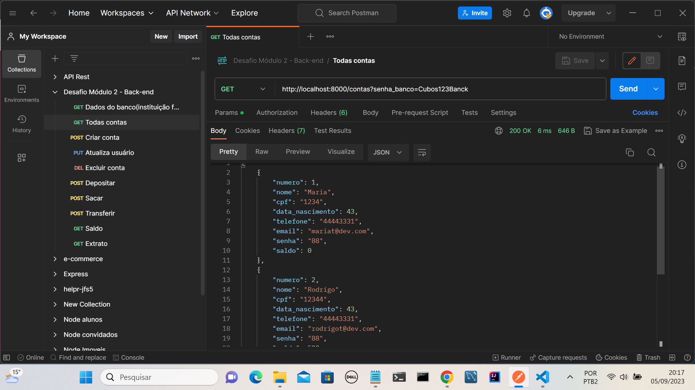
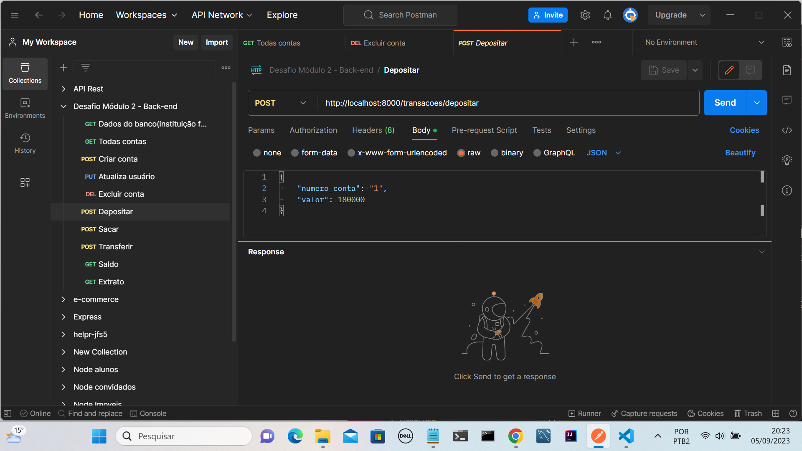
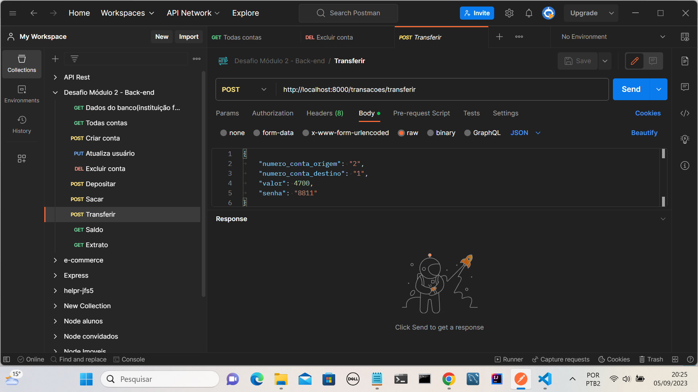
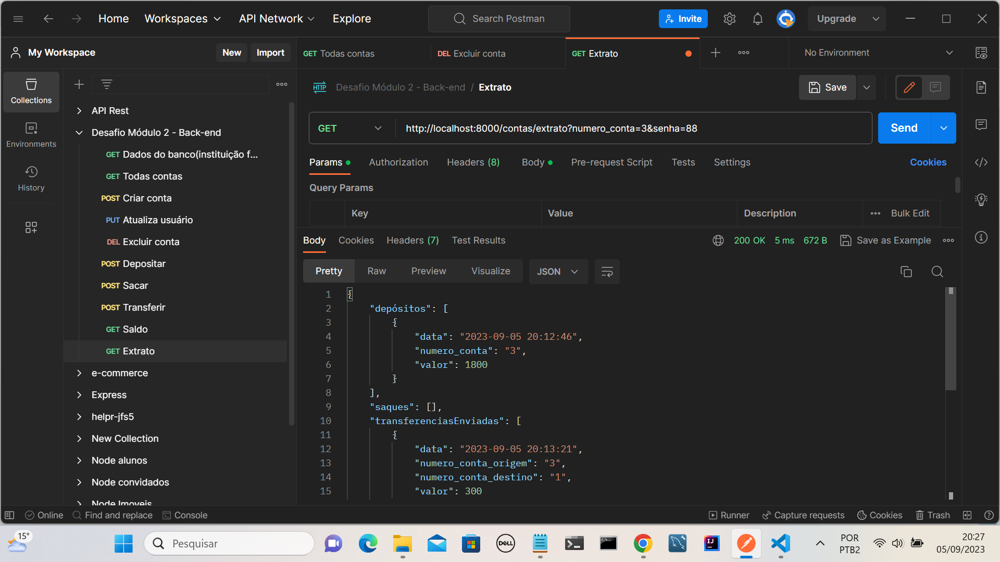

# API Sistema Bancário

Este é um projeto Node.js de um sistema bancário proposto pela [Cubos Academy](https://www.cubos.academy/) em colaboração com o [iFood](https://www.ifood.com.br/). A API permite a criação de contas bancárias, depósitos, saques, transferências e consulta de saldo, extrato e exclusão da conta. O sistema é implementado seguindo padrões [RESTful](https://restfulapi.net/).

## Tecnologias utilizadas


- [Node.js](https://nodejs.org/): Plataforma de execução JavaScript no servidor.
- [Date-fns](https://date-fns.org/): Biblioteca para tratamento de data.
- [Express.js](https://expressjs.com/): Um framework web para Node.js.
- [Nodemon](https://www.npmjs.com/package/nodemon): Ferramenta para reiniciar automaticamente o servidor durante o desenvolvimento.

Se for do seu interesse executar e testar localmente o projeto, você terá que seguir os seguintes passos.

- Fazer o fork do projeto para o seu [Github](https://www.github.com).
- Clonar o repositório para a sua máquina depois de ter forkado.
- Abrir o projeto com o [VScode](https://www.vscode.com) ou no seu editor de preferência.

Para instalar essas bibliotecas, você pode usar o npm (Node Package Manager). Execute o seguinte comando no diretório raiz do projeto:

```bash
npm install express fns-date nodemon
```

Para rodar o servidor, use o código:

```bash
npm run dev
```

Para fazer as requisições à nossa API, foi utilizado uma ferramenta bastante conhecida no mercado, o [Postman](https://https://www.postman.com/). Com essa ferramenta podemos testar todos os endpoints(rotas) das funcionalidades.


## Todas as contas:



## Depositar:



## Transferência:



## Extrato:



Estas imagens representam algumas funcionalidades do sistema.
